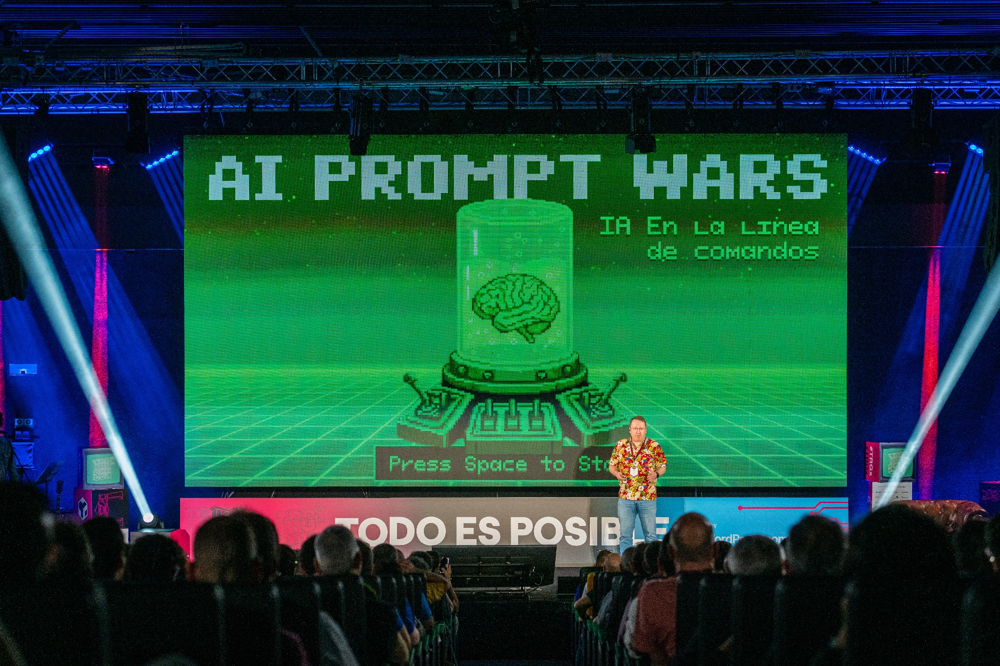

<h1>Ser speaker en la TRG</h1>
 
[Las Charlas](#-las-charlas) •
[Qué aportamos a nuestros speakers](#%EF%B8%8F-qu%C3%A9-aportamos-a-nuestros-speakers) •
[Algunos speakers de pasadas ediciones](#-algunos-speakers-de-pasadas-ediciones) •
[Recursos para speakers](#-recursos-para-speakers) •
[FAQ](#-faq) •
[Contacto](#%EF%B8%8F-contacto)

Ser ponente de la TRG es una experiencia diferente. Empezando porque **la única forma de convertirte en uno/a de ellos es mediante invitación** y terminando porque te proponderemos el tema sobre el que vas a hablar para que tú puedas desarrollarlo :)

Una de las cosas más peculiares de la conferencia es que tiene «línea editorial». Primero **seleccionamos los temas que nos parecen más interesantes y, después, a las personas que creemos más apropiadas para hablar sobre los mismos.** Por ejemplo, a ti.

NO hay charlas patrocinadas, solo un único *track* con todos los contenidos son planificados y cuidados con detalle.

En esta edición **queremos que las charlas giren alrededor del trabajo con la Inteligencia Artificial**, pero desde un punto de vista diferente al habitual. Sin la cerrazón del que se niega a aceptar que todo va a cambiar ni tampoco el _FOMO_ apocalíptico del que afirma que nada va a continuar. Charlas prácticas y basadas en experiencias reales que ayuden a los asistentes a _leer_ por dónde irá la industria en los próximos años... y adaptarse a la misma.

Si aceptas nuestra invitación, nos reuniremos contigo para explicarte nuestra idea y consensuar la visión de tu charla. Propondrás las lineas maestras de tu presentación y, después de confirmar que estamos alineados, se confirmará tu ponencia.

Si lo deseas, te ayudaremos con el *storytelling* y el diseño de la presentación para que esta sea PERFECTA, pero tú tendrás SIEMPRE la última palabra.

 

## 🍿 Las charlas
 
- **1** solo track
- **30** minutos de charla
- **+15** de Q&A
- **Control** de difusión audiovisual

«Ningún discurso es demasiado corto». En la TRG creemos en las enseñanzas de los legendarios Kenneth Roman y Joel Raphaelson, por eso nuestras charlas «solo» duran 30 minutos. Eso sí, tenemos un turno de preguntas de 15 minutos —desarrollado en formato entrevista, sentado en un sofá, como en un *late night show*— que SIEMPRE se nos queda corto. ¡La interactuación con el público suele ser tan interesante como la charla en sí!

No tendrás que competir con otro ponente. Hay un sólo track, así que **toda la atención del evento estará puesta en tu charla.**

Más allá del tema, **tendrás total libertad para desarrollar tu charla.** Sólo te pediremos que sigas nuestro sencillo [código de conducta](https://trgcon.com/codigo-de-conducta/).

Durante todo el proceso de creación de tu presentación, contarás con nuestro feedback y nuestra ayuda para **conseguir un resultado memorable** como, por ejemplo, la charla que dio Antonio en 2023 sobre cómo una fabrica de polvorones se convirtió en una empresa puntera de I+D ¡_caviar_!

 

## 🛍️ Qué aportamos a nuestros speakers

Remuneramos a ponentes speakers con **una pequeña gratificación de 250€**, pero el esfuerzo invertido en preparar una charla es igual que el esfuerzo invertido en preparar un evento —nunca es rentable desde el punto de vista económico— así que, lo menos que podemos hacer es compensarlos en su justa medida. Ellos son las verdaderas estrellas de la TRG.

✈️ Viaje: por supuesto, nos haremos cargo de tu viaje para que puedas disfrutar del evento completo, no sólo el día de tu charla. 
🛏️ Alojamiento: También cubrimos tu alojamiento. Y si quieres venir con la familia, reservaremos una habitación en la que quepáis todos. 
🎨 Diseño: Si lo deseas, nuestro diseñador [Hugo Tobio](https://hugotobio.com/) revisará tu presentación y la «vestirá» con un aspecto profesional para que brille. 
🎭 Storytelling: Si quieres, te ayudaremos a descubrir la historia detrás de los datos y los hechos, para cautivar a la audiencia. 
💎 Acceso VIP: Tu entrada te dará acceso a todas las actividades de la TRG, desde los talleres del jueves hasta el Open Space del sábado. 
🎁 Regalo: Somos gallegos, así que, cuenta con un regalo de cortesía. Probablemente, relacionado con la gastronomía... 
🎟️ _Alumni_: Todos los ponentes de la TRG tienen garantizada una entrada para la siguiente edición. Sin coste. 
🎥 Vídeo: Tu charla será grabada por 5 cámaras que recogerán todos los detalles y publicada en Vimeo. Si nos das tu consentimiento, claro :) 
🚕 Transporte: Nos haremos cargo no sólo de tu viaje hasta Madrid sino de tus desplazamientos dentro de la ciudad. Faltaría más. 
🤝 Networking: Acceso a la exclusiva cena de mecenas y ponentes donde conocerás y te conocerán en un ambiente familiar. 
❤️ Cariño: Para nosotros no serás un ponente sino nuestro invitado. Nos dejaremos la piel para que te sientas como en casa. 
😺 Buen ambiente: De verdad. Aquí no te encontrarás _preguntas-trampa_ ni gente que quiere demostrar que sabe más que tú en algo.

 

## 🌟 Algunos speakers de pasadas ediciones

> Después de 10 años, aun me siguen recordando la charla que di en la primera TRG. Incluso gente que no estuvo allí... ~ Javi Santana, Fundador de Carto y Tinybird
 

Esta es una pequeña muestra de ponentes de otras ediciones, tanto para que puedas comprobar qué tipo de personas que vienen a la TRG como para que puedas contactarlas y pedirles referencias sobre cómo fue la experiencia:

| PONENTE | EDICIÓN | CHARLA |
| - | :-: | - |
| [Pablo Sánchez](https://es.wikipedia.org/wiki/Pablo_S%C3%A1nchez_Bergasa) – Director de la ONG Medical Open World | 2025 | [«Open Source que salva vidas»](https://vimeo.com/trgcon/trgx-pablo?share=copy&fl=sv&fe=ci) |
| [Sandra Hernandez](https://www.linkedin.com/in/sandra-hernandez-sendino-13257b153/) – Systems Engineer en la NASA | 2023 | [«Cómo hacer testing cuando tu código se ejecuta a 600 millones de kilómetros de distancia»](https://vimeo.com/trgcon/trg23-sandra?share=copy&fl=sv&fe=ci) |
| [Jaime Gomez-Obregón](https://twitter.com/JaimeObregon) – Activista | 2021 | [«Aportando transparencia a la Administración Pública mediante la Informática»](https://vimeo.com/650199371) |
| [Eva Belmonte](https://twitter.com/evabelmonte) – Directora de Civio | 2020 | [«Transparencia e Información durante el COVIDgedón»](https://vimeo.com/500138922) |
| [Javier G. Recuenco](https://twitter.com/Recuenco) – Fundador y CSO - Singular Solving | 2022 | [«Un framework mental para enfrentarte al mundo real»](https://vimeo.com/830825538) | 
| [Jimena Catalina](https://twitter.com/subidubi) – Creadora de Slides Carnival | 2016 | [«La culpa SIEMPRE es del diseñado»r](https://www.youtube.com/watch?v=bUqB-ipn54o) |

<!-- SPEAKERS-LIST:START - Do not remove or modify this section -->
<!-- prettier-ignore-start -->
<!-- markdownlint-disable -->
<table>
  <tr>    
   <td align="center"><a href="https://twitter.com/vomkriege"> <b>Daniel Lopez (2018)</b></a></td>
    <td align="center"><a href="https://twitter.com/AndreaBarberL"> <b>Andrea Barber (2019)</b></a></td>
    <td align="center"><a href="https://twitter.com/molpe"> <b>Alberto Molpeceres (2016)</b></a></td>
    <td align="center"><a href="https://twitter.com/estheralone"> <b>Esther Alonso (2018)</b></a></td>
   <td align="center"><a href="https://twitter.com/javisantana"> <b>Javi Santana (2016 y 2021)</b></a></td>
   <td align="center"><a href="https://twitter.com/crissantamarina"> <b>Cristina Santamarina (2017)</b></a></td>
  </tr>
</table>

<!-- markdownlint-restore -->
<!-- prettier-ignore-end -->

<!-- SPEAKERS-LIST:END -->
... y muchos más.

 

## 🧰 Recursos para speakers

Materiales e información que puede ayudar a los speakers a entender mejor la filosofía y cultura detrás la TRG; y —tambien— a comprender la experiencia que vivirán en el evento.

* [El video-resumen de la TRGx (2026)](https://vimeo.com/trgcon/trgx-resumen)
* [El making-of de la TRGx (2026)](https://vimeo.com/trgcon/trgx-makingof)
* [El postmortem de la TRG23](https://www.bonillaware.com/postmortem-trg23)
* [Álbumes en Flickr con (miles) fotos de todas las ediciones](https://www.flickr.com/photos/tarugoconf/albums)

 

## ❓ FAQ

 
<b>¿Qué tipo de audiencia me voy a encontrar?</b>

  
 A la TRG acuden cerca de 1.000 profesionales del sector tecnológico (CEOs, CTOs, VCs, desarrolladores, diseñadores, marketers…) con más de 10 años de experiencia de media.<ber/>  Es decir, que vas a tener una audiencia compuesta por un 50% de técnicos y otro 50% que no lo es... y esa es la gracia :)

 
<b>¿Cómo se va a proyectar mi charla?</b>

  
 Tu charla se proyectará en una pantalla de unos 30m2, con formato 16:9, que estará detrás de ti.  Delante de ti, en el escenario, tendrás dos monitores para poder ver el tiempo que llevas hablando y tanto la diapositiva que tienes detrás como la siguiente que va a salir.  Estarás microfonado con un un micro de diadema que te permitirá tener las manos libres y te daremos un mando industrial que te permitirá pasar las diapositivas sin ningún tipo de interferencia.  No tendrás que conectar nada, solo salir al escenario y triunfar :)

 
<b>¿Cómo debo diseñar mi charla?</b>

 
 Nosotros <b>montamos todo en una presentación maestra de Keynote</b>, así que, si quieres que tus diapositivas se vean EXACTAMENTE como las has diseñado, te recomendamos que uses Keynote o que las entregues en PDF, pero con este segundo formato no podrás incluir transiciones, efectos o multimedia.  Si no usas Apple, puedes usar Keynote y haremos todo lo posible para que la presentación quede lo más parecida a cómo la concebiste, pero.. precisamente por eso necesitamos que nos las envieís ANTES del evento.

 
<b>¿Por qué tengo que enviar mi charla ANTES del evento?</b>

  
 Primero, para que cuando acudas a la TRG vayas con la tranquilidad que da saber que solo debes dar tu charla y no preocuparte de nada más, pero sobre todo, <b>porque va a ir montada en un ordenador conectado al control audiovisual del auditorio</b>, así que, necesitamos algo de tiempo para integrarlo con el resto de presentaciones y asegurarnos de que todo se ve bien.

 
<b>¿Tengo que consensuar con vosotros todo el contenido?</b>

  
 ¡No, no! Nosotros te ayudaremos a definir la narrativa, pulir el discurso, eliminar «ruido» o incluso afinar el diseño para que se vea bien en un auditorio grande, pero la última palabra siempre la tendrás tú.

 
<b>¿Puedo promocionar mi empresa?</b>

  
 Pues claro ¿por qué no? Puedes llevar ropa con vuestro <i>branding</i>, o llevar <i>merchandising</i> para regalar a la gente con la que hables. Y, por supuesto, puedes mencionarla en tu charla.  Eso sí, si te pasas de frenada <i>marketiniana</i> (por ejemplo, poner el logo de tu empresa en TODAS las diapositivas o que el contenido vaya de lo buenos que sois en algo en vez de contar ese algo), te lo advertiremos por si quieres rectificar. No porque nos pueda molestar sino porque sabemos cómo lo va a percibir la audiencia y no va a aportarles valor ni a ellos... ni a ti.

 
<b>¿Qué pasa si una vez que vea la grabación de mi charla no me gusta o digo algo que en realidad no debería haber dicho?</b>

  
 Antes de publicar absolutamente nada, te enviaremos un enlace privado para que puedas revisar el video tranquilamente. Si después de hacerlo no quieres publicarlo, no lo haremos. Tú mandas.

 
<b>¿Hay algo que no pueda o deba hacer durante el evento?</b>

  
 Con que uses el sentido común y respetes a los demás, es suficiente. Tenemos un <a href="https://trgcon.com/codigo-de-conducta/" target="_blank">código de conducta</a> que así lo refleja y que debemos seguir todos los asistentes.  Más allá de eso, como speaker si te pediremos que tengas un teléfono cerca siempre por si tenemos que localizarte. Y que estés en al auditorio al menos media hora antes de tu charla, para que podamos microfonarte.

 
<b>¿Debo ir los tres días del evento?</b>

  
 Por supuesto que no. A ver... a nosotros nos gustaría que exprimieras el evento al MÁXIMO, pero si no puedes, no puedes.  Te recomendamos eso sí, que no te pierdas la cena de patrocinadores, mecenas y ponentes del jueves y que estés en el inicio de la jornada del viernes ¡Suele haber sorpresas!

 
<b>¿Y si me da pereza porque no conozco a nadie?</b>

  
 No te preocupes. Una persona de la organización se encarga exclusivamente de que a los speakers no os falte de nada. Eso incluye contactaros ANTES del evento —para que tengáis su contacto— y recibiros nada más llegar.  En la cena de patrocinadores, mecenas y ponentes conocerás a tus compañeros y a mucha, MUCHA más gente. Otra cosa no podemos asegurarte, pero que vas a tener compañía eso seguro :)

 
<b>¿No hay <em>call for papers</em>?</b>

  
 Pues no. Todos los ponentes son invitados por la organización, pero si conoces a alguien que crees que puede aportar muchísimo al evento, por favor escríbenos a <a href="mailto:tarugoconf@bonillaware.com" target="_blank">tarugoconf AT bonillaware DOT com</a> ¡incluso aunque ese <i>alguién</i> seas tú!

 

## ☎️ Contacto

La coordinación de speakers está a cargo de [@david_bonilla](https://twitter.com/david_bonilla). La parte logística (transporte, alojamiento, acreditaciones, pagos...).

En cualquier caso, si tenéis cualquier duda o pregunta, podéis contactar con el equipo en [tarugoconf AT bonillaware DOT com](mailto:tarugoconf@bonillaware.com) :email:
