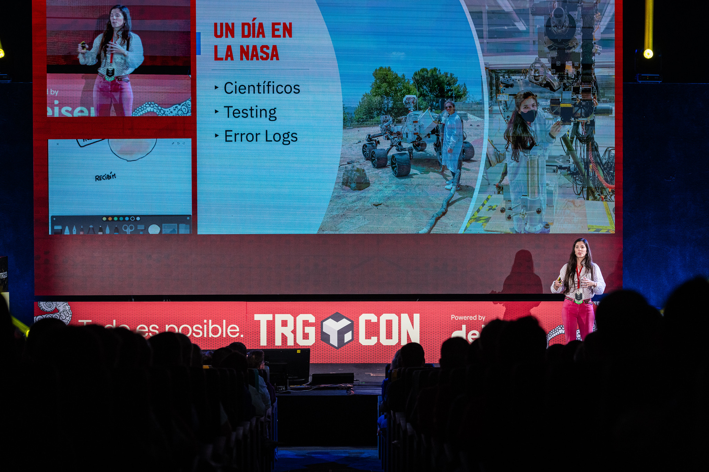
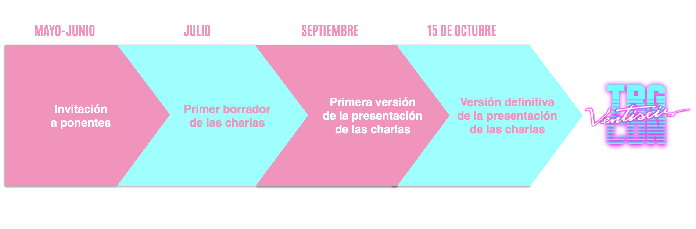
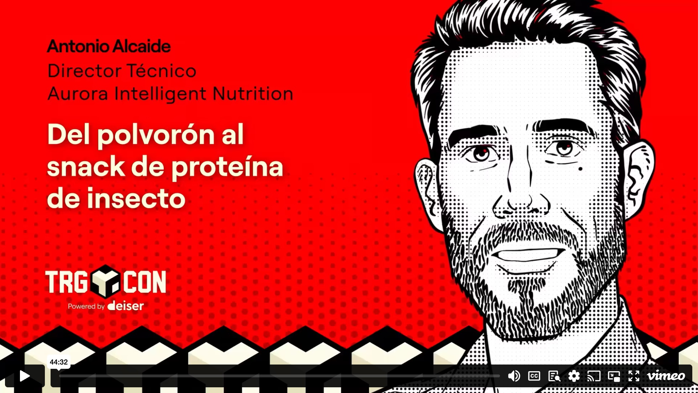

<h1>Ser speaker en la TRG</h1>
 
[Las Charlas](#-las-charlas) •
[Qué aportamos a nuestros speakers](#%EF%B8%8F-qu%C3%A9-aportamos-a-nuestros-speakers) •
[Algunos speakers de pasadas ediciones](#-algunos-speakers-de-pasadas-ediciones) •
[Recursos para speakers](#-recursos-para-speakers) •
[FAQ](#-faq) •
[Contacto](#%EF%B8%8F-contacto)

Ser ponente de la TRG es una experiencia diferente. Empezando porque, hasta ahora, **la única forma de convertirte en uno/a de ellos es mediante invitación** y terminando porque te proponderemos el tema sobre el que vas a hablar para que tú puedas desarrollarlo :)

Una de las cosas más peculiares de la conferencia es que tiene «línea editorial». Primero **seleccionamos los temas que nos parecen más interesantes y, después, a las personas que creemos más apropiadas para hablar sobre los mismos.** Por ejemplo, a ti. No hay charlas patrocinadas, solo un único *track* con todos los contenidos son planificados y cuidados con detalle.

En esta edición queremos que las charlas giren alrededor de **las raices de la Informática y los valores que la modelaron**, pero desde un punto de vista diferente al habitual.

Si aceptas nuestra invitación, nos reuniremos para explicarte nuestra idea y consensuar la visión de tu charla. Propondrás las lineas maestras de tu presentación y, tras la propuesta, se confirmará tu ponencia. Si lo deseas, te ayudaremos con el *storytelling* y el diseño de la presentación para que esta sea PERFECTA, pero tú tendrás SIEMPRE la última palabra.

 

## 🍿 Las charlas
 
- **1** solo track
- **30** minutos de charla
- **+15** de Q&A
- **Sketchnoting** en directo
- **Control** de difusión audiovisual

«Ningún discurso es demasiado corto». En la TRG creemos en las enseñanzas de los legendarios Kenneth Roman y Joel Raphaelson, por eso nuestras charlas «solo» duran 30 minutos. Eso sí, tenemos un turno de preguntas de 15 minutos —desarrollado en formato entrevista, sentado en un sofá, como en un *late night show*— que SIEMPRE se nos queda corto. ¡La interactuación con el público suele ser tan interesante como la charla en sí!

No tendrás que competir con otro ponente. Hay un sólo track, así que **toda la atención del evento estará puesta en tu charla.**

Más allá del tema, **tendrás total libertad para desarrollar tu charla.** Sólo te pediremos que sigas nuestro sencillo [código de conducta](https://trgcon.com/codigo-de-conducta/).

Durante todo el proceso de creación de tu presentación, contarás con nuestro feedback y nuestra ayuda para **conseguir un resultado memorable.**

 

## 🛍️ Qué aportamos a nuestros speakers

Remuneramos a ponentes speakers con **una pequeña gratificación de 250€**, pero el esfuerzo invertido en preparar una charla es igual que el esfuerzo invertido en preparar un evento —nunca es rentable desde el punto de vista económico— así que, lo menos que podemos hacer es compensarlos en su justa medida. Ellos son las verdaderas estrellas de la TRG.

✈️ Viaje: por supuesto, nos haremos cargo de tu viaje para que puedas disfrutar del evento completo, no sólo el día de tu charla. 
🛏️ Alojamiento: También cubrimos tu alojamiento. Y si quieres venir con la familia, reservaremos una habitación en la que quepáis todos. 
🎨 Diseño: Si lo deseas, nuestro diseñador revisará tu presentación y la «vestirá» con un aspecto profesional para que brille. 
🎭 Storytelling: Si quieres, te ayudaremos a descubrir la historia detrás de los datos y los hechos, para cautivar a la audiencia. 
💎 Acceso VIP: Tu entrada te dará acceso a todas las actividades de la TRG, desde los talleres del jueves hasta el Open Space del sábado. 
🎁 Regalo: Somos gallegos, así que, cuenta con un regalo de cortesía, probablemente, relacionado con la gastronomía... 
🎟️ Entradas: Todos los ponentes de la TRG tienen garantizada una entrada para la siguiente edición. Sin coste. 
🖼️ Sketchnoting: Tu charla será «dibujada» por nuestro sketchnoter y podrás disponer del dibujo y difundirlo como consideres. 
🎥 Vídeo: Tu charla será grabada por 5 cámaras que recogerán todos los detalles y publicada en Vimeo. Si nos das tu consentimiento, claro :) 
🚕 Transporte: Nos haremos cargo no sólo de tu viaje hasta Madrid sino de tus desplazamientos dentro de la ciudad. Faltaría más. 
🤝 Networking: Acceso a la exclusiva cena de mecenas y ponentes donde conocerás y te conocerán en un ambiente familiar. 
❤️ Cariño: Para nosotros no serás un ponente sino nuestro invitado. Nos dejaremos la piel para que te sientas como en casa. 
😺 Buen ambiente: amigable etc.

 

## 🌟 Algunos speakers de pasadas ediciones

> Después de 7 años, aun me siguen recordando la charla que di en la primera TRG. Incluso gente que no estuvo allí... ~ Javi Santana, Fundador de Carto y Tinybird
 

Esta es una pequeña muestra de ponentes de otras ediciones, tanto para que puedas comprobar qué tipo de personas que vienen a la TRG como para que puedas contactarlas y pedirles referencias sobre cómo fue la experiencia:

| PONENTE | EDICIÓN | CHARLA |
| - | :-: | - |
| [Jaime Gomez-Obregón](https://twitter.com/JaimeObregon) – Activista | 2021 | [«Aportando transparencia a la Administración Pública mediante la Informática»](https://vimeo.com/650199371) |
| [Eva Belmonte](https://twitter.com/evabelmonte) – Directora de Civio | 2020 | [«Transparencia e Información durante el COVIDgedón»](https://vimeo.com/500138922) |
| [Javier G. Recuenco](https://twitter.com/Recuenco) – Fundador y CSO - Singular Solving | 2022 | [«Un framework mental para enfrentarte al mundo real»](https://vimeo.com/830825538) | 
| [Jimena Catalina](https://twitter.com/subidubi) – Creadora de Slides Carnival | 2016 | [«La culpa SIEMPRE es del diseñado»r](https://www.youtube.com/watch?v=bUqB-ipn54o) |

<!-- SPEAKERS-LIST:START - Do not remove or modify this section -->
<!-- prettier-ignore-start -->
<!-- markdownlint-disable -->
<table>
  <tr>    
   <td align="center"><a href="https://twitter.com/vomkriege"> <b>Daniel Lopez (2018)</b></a></td>
    <td align="center"><a href="https://twitter.com/AndreaBarberL"> <b>Andrea Barber (2019)</b></a></td>
    <td align="center"><a href="https://twitter.com/molpe"> <b>Alberto Molpeceres (2016)</b></a></td>
    <td align="center"><a href="https://twitter.com/estheralone"> <b>Esther Alonso (2018)</b></a></td>
   <td align="center"><a href="https://twitter.com/javisantana"> <b>Javi Santana (2016 y 2021)</b></a></td>
   <td align="center"><a href="https://twitter.com/crissantamarina"> <b>Cristina Santamarina (2017)</b></a></td>
  </tr>
</table>

<!-- markdownlint-restore -->
<!-- prettier-ignore-end -->

<!-- SPEAKRES-LIST:END -->
... y muchos más.

 

## 🧰 Recursos para speakers

Materiales e información que puede ayudar a los speakers a entender mejor la filosofía y cultura detrás la TRG; y —tambien— a comprender la experiencia que vivirán en el evento.

* [El postmortem de la última edición (2023)](https://www.bonillaware.com/postmortem-trg23)
* [Vídeo-resumen de la TRG23 (2022)](https://vimeo.com/928563768?share=copy`)
* [Álbumes en Flickr con (miles) fotos de todas las ediciones](https://www.flickr.com/photos/tarugoconf/albums)

 

## ❓ FAQ

 
¿No hay <em>call for papers</em>?

  
 Pues, hasta ahora, no. Todos los ponentes han sido invitados por la organización, pero este año <b>hemos reservado una de las charlas</b> para propuestas de la Comunidad. Si te animas, puedes enviar la tuya <a href="https://docs.google.com/forms/d/1d6ouzdXtsfQ4DVrXIH_07LAbkvWud-KcS-sLqr4XNnU/viewform?edit_requested=true" target="_blank">aquí</a>.

 

## ☎️ Contacto

La coordinación de speakers está a cargo de [@david_bonilla](https://twitter.com/david_bonilla). La parte logística (transporte, alojamiento, acreditaciones, pagos...) la gestiona [@candelamd](https://twitter.com/candelamd) y el *call for papers* está organizado por [@jerolba](https://twitter.com/jerolba) e [@ydarias](https://twitter.com/ydarias).

En cualquier caso, si tenéis cualquier duda o pregunta, podéis contactar con el equipo en [tarugoconf@bonillaware.com](mailto:tarugoconf@bonillaware.com) :email:
